# Bitmap Shellcode Encoder

> **Did you use this project during an assignment? Let me know!**

A simple steganography algorithm to obfuscate shellcode (or other data) within bitmap images.

Security analysts employ diverse techniques to obfuscate codes in order to evade detection by anti-malware solutions. These methods include the utilization of symmetric block encryption, UUIDs, and various other obfuscation strategies.

The objective of this project is to obscure shellcodes within bitmap images. It is important to note that this process does not entail backdorization of the image; instead, it mandates the presence of a suitable decoder for reading and subsequent execution. This approach effectively mitigates the risk of the shellcode being detected during static scans.

Other algorithms for obfuscations, such as AES, may also be flagged when using some libs, since it became very common for this type of application.

It still may be detected by behavior analysis.

The loader may be modified to avoid its detection, but the technique will keep working as the same protocol to decode is used.

`datavisualizer-lin.c` Loader for linux.

`datavisualizer-win.c` Loader for windows.

`bitmapvis-win.cpp` Loader for windows. Loads also a window showing the bitmap to look like a normal image visualizer.

You may customize the loader to fit your use case.



### How To Use

Compile:

```
x86_64-w64-mingw32-gcc datavisualizer-win.c
gcc datavisualizer-lin.c
gcc -o main main.c
```

Having a bitmap image of 32 bits and the shellcode in raw format, encode the shellcode over the pixel array of the image:

```
╰─$ gcc main -b 32bit.bmp -r infected.bmp -f shellcode.bin -s
Magic Number: BM
Size: 118
Offset: 54
100wpx x 100hpx of 32bits
Off Size: 40000
Image may hold 5000b -> 4Kb
5704 bits written and bytes modified
infected.bmp modified
```

The image `infected.bmp` has been create with the shellcode encoded in it.

Execute the shellcode:

```
> .\a.exe -b .\infected.bmp -e
Data hidden -> Magic: 0xDEAD
Hidden data length 707b
707b: fc4883e4f0e8cc00
```

Type `-h` to see the full help menu.

### Studing

The following block is the dump of a bitmap header and dib header.

```
00000000: 424d 7600 0000 0000 0000 3600 0000 2800  BMv.......6...(.
00000010: 0000 6400 0000 6400 0000 0100 2000 0000  ..d...d..... ...
00000020: 0000 4000 0000 0000 0000 0000 0000 0000  ..@.............
00000030: 0000 0000 0000 4080 c000 4080 c000 4080  ......@...@...@.
```

Bitmap Header: 14 Bytes

```
     424d -> BM magic numbs
7600 0000 -> BM file size
     0000 -> No use 
     0000 -> No use
0000 3600 -> Offset start byte array
```

DIB Header

```
2800 0000 -> DIB head length
6400 0000 -> Width pixels
6400 0000 -> Height pixels
     0100 -> Number of color planes
     2000 -> Bits per pixel = 32
0000 0000 -> Pixel array compression used
4000 0000 -> Size of the raw bitmap data (including padding)
0000 0000 -> Pixels per meter
0000 0000 -> Pixels per meter
0000 0000 -> Colors in pallet
0000 0000 -> Important colors (all colors)
```

Start bit array

```
4080 c000 -> 40 -> blue
             80 -> gren
             c0 -> red
             00 -> padding / alpha
```

I have i pixel as the following array `4080c000`, the binary representation would be:
```
01000000 10000000 11000000 00000000
```

If I want to store four bits like `1111`, I may place it ending each byte.

```
0100000`1 1000000`1 1100000`1 0000000`1
```

I would have a varition of one bit for the color in the worst case, probably not humanly noticeable.

For each byte to store I need 8 bytes since the last bit will be taken to compile one byte. I need one way to get my stored data from a array of bytes.

For a given array of bytes, get the last bit of each of these bytes and compile a unique byte.

```
11011010 00101001 10110101 01001011 
11111100 00000001 10010010 01010101

Result: 01110101
```

The oposit, saving the data as did before.

For a given byte and array of bytes, take each bit from the byte and place ending each corresponding byte from the array.

```
Byte: 10101010

Result:
00000001 00000000 00000001 00000000
00000001 00000000 00000001 00000000

```

For instance, the fisrt byte is 0x03 (00000011) the swapt occurs with 0 (the corresponding bit), so the resulting byte should be 0x02 (00000010).

First we clear the last bit of a byte by performing a bitwise AND (&) against the byte 0xFE (11111110). Take 0x03 as example.

```
      11111110 0xFE
    & 00000011 0x03
      ========
      00000010 result 0x02
```

Then we do a bitwise OR (|) with the byte and 0x01 (00000001) passing the bit to it.


Bit operations
http://www.inf.puc-rio.br/~noemi/eda-19.1/bitwise.pdf

Get each bit from byte
https://stackoverflow.com/questions/8695945/c-get-a-bit-from-a-byte

Turn int into array of bytes
https://stackoverflow.com/questions/3784263/converting-an-int-into-a-4-byte-char-array-c

https://www.ripublication.com/ijaer17/ijaerv12n21_19.pdf